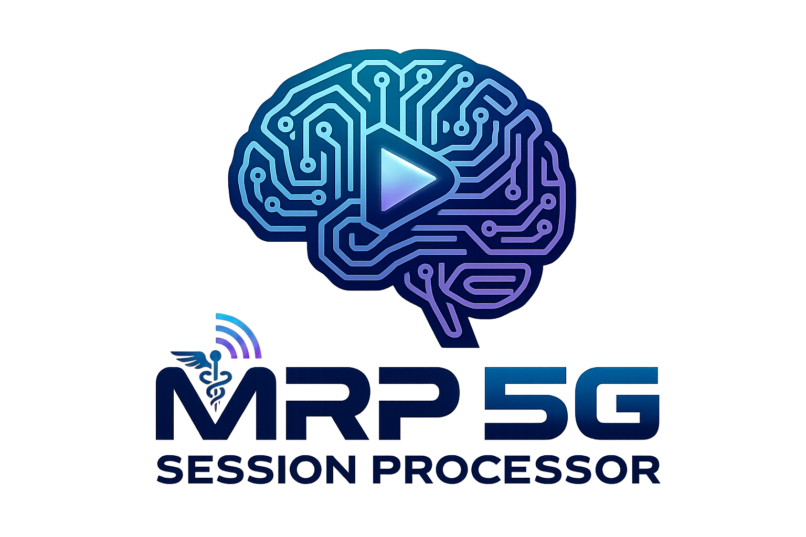
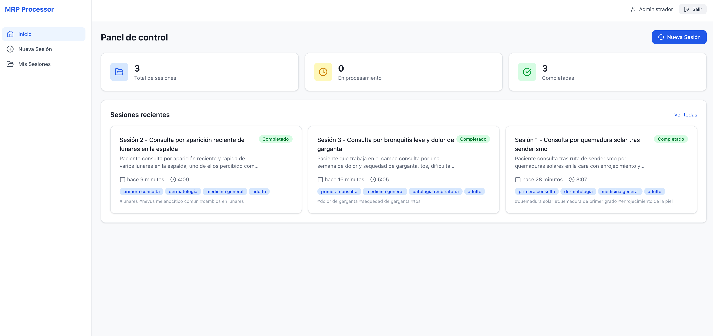
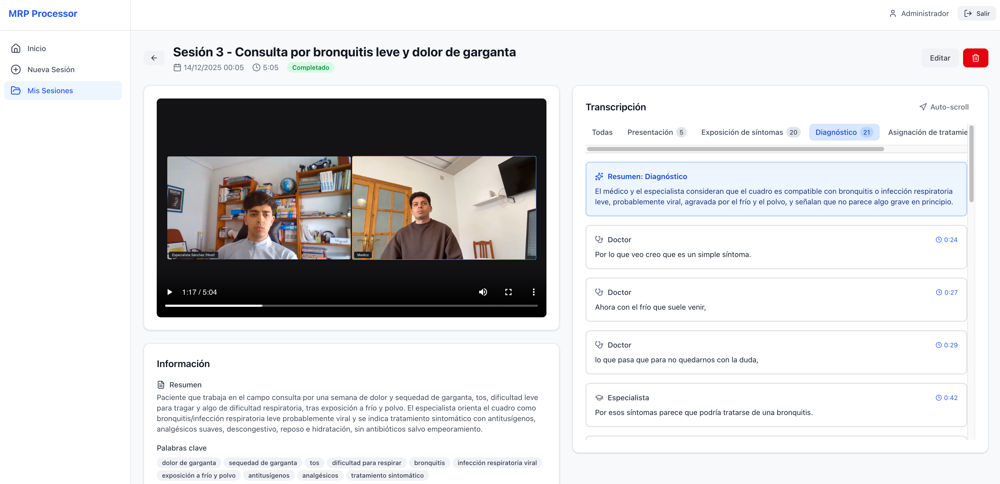

# MRP 5G Session Processor

<p align="center">
  
</p>

Application for processing medical session videos. It allows uploading medical consultation recordings, automatically transcribing them, identifying speakers (doctor/patient/specialist), and segmenting the content into structured clinical sections with automatic summaries.

## Screenshots

### Dashboard

*Dashboard with session statistics, list of recent consultations with status, duration, tags, and keywords.*

### Session Detail

*Session view with video player, transcription segmented by medical sections, automatic summaries, and general information.*

## Features

- **Automatic transcription** with speaker identification using GPT-4o Transcribe Diarize
- **Intelligent segmentation** into medical sections (introduction, symptoms, diagnosis, treatment, closing)
- **Automatic summaries** per section and overall using GPT-5.1
- **Metadata generation**: automatic title, keywords, and tags
- **Full-text search** in transcriptions and metadata
- **Video streaming** with transcription synchronization
- **Asynchronous processing** with job queue

## Tech Stack

| Component | Technology |
|-----------|------------|
| Frontend | React 19 + Vite + Tailwind CSS + TypeScript |
| Backend | Express.js + TypeScript |
| Database | SQLite (better-sqlite3) |
| Storage | S3 (Garage for local development) |
| Queue | BullMQ + Redis |
| AI | OpenAI SDK (gpt-4o-transcribe-diarize, gpt-5.1) |

## Prerequisites

- Node.js 20+
- pnpm 9+
- Docker and Docker Compose
- ffmpeg (installed and accessible in PATH)

## Installation

```bash
# Clone the repository
git clone <repo-url>
cd mrp-5g-session-processor

# Install dependencies
pnpm install

# Start Docker services (Garage S3 + Redis)
pnpm docker:up

# Initialize Garage S3
pnpm docker:init

# Run migrations
pnpm db:migrate

# Seed users
pnpm db:seed
```

## Configuration

Create a `.env` file in the project root:

```env
# Backend
PORT=3001
NODE_ENV=development
SESSION_SECRET=your-secret-key

# SQLite
DATABASE_PATH=./data/mrp.db

# S3 (Garage)
S3_ENDPOINT=http://localhost:3900
S3_BUCKET=mrp-videos
S3_ACCESS_KEY=your-access-key
S3_SECRET_KEY=your-secret-key
S3_REGION=garage

# Redis (BullMQ)
REDIS_URL=redis://localhost:6379

# OpenAI
OPENAI_API_KEY=sk-...
```

## Usage

```bash
# Development (frontend + backend in parallel)
pnpm dev

# Backend only
pnpm dev:backend

# Frontend only
pnpm dev:frontend

# Production build
pnpm build

# Tests
pnpm test

# Linting
pnpm lint
```

## Project Structure

```
mrp-5g-session-processor/
├── docker/                   # Docker Compose (Garage S3 + Redis)
├── packages/
│   ├── shared/               # Shared TypeScript types
│   ├── backend/              # Express.js API
│   │   ├── src/
│   │   │   ├── controllers/  # REST controllers
│   │   │   ├── db/           # Schema, migrations, repositories
│   │   │   ├── middleware/   # Auth, upload, errors
│   │   │   ├── routes/       # Route definitions
│   │   │   ├── services/     # Business logic
│   │   │   └── services/processing/  # Processing workers
│   │   └── scripts/          # seed-users.ts
│   └── frontend/             # React SPA
│       └── src/
│           ├── api/          # HTTP client
│           ├── components/   # UI components
│           ├── context/      # AuthContext
│           ├── hooks/        # Custom hooks
│           └── pages/        # App pages
├── pnpm-workspace.yaml
└── .env                      # Configuration (do not commit)
```

## API Endpoints

### Authentication
- `POST /api/auth/login` - Login with email/password
- `POST /api/auth/logout` - Logout
- `GET /api/auth/me` - Current authenticated user

### Medical Sessions
- `GET /api/sessions` - List user sessions
- `POST /api/sessions` - Create session + upload video
- `GET /api/sessions/:id` - Detail with transcription and summaries
- `GET /api/sessions/:id/status` - Processing status
- `GET /api/sessions/:id/video/stream` - Video streaming
- `PATCH /api/sessions/:id` - Update metadata
- `DELETE /api/sessions/:id` - Delete session

### Search
- `GET /api/search?q=` - Fuzzy search in transcriptions and metadata

## Processing Flow

1. User uploads video → saved to S3
2. Job created in BullMQ queue
3. Worker downloads video and extracts audio with ffmpeg
4. Transcription with speaker identification (gpt-4o-transcribe-diarize)
5. Segmentation into medical sections and speaker re-labeling (gpt-5.1)
6. Summary and metadata generation (gpt-5.1)
7. Status updated to "completed"

## Production Deployment

The application is deployed with Docker Compose. Express serves both the API and the static frontend.

### 1. Clone and configure

```bash
git clone <repo-url> mrp-5g-session-processor
cd mrp-5g-session-processor/docker
cp .env.prod.example .env
```

### 2. Edit environment variables

Edit `docker/.env` with actual values:

| Variable | Description |
|----------|-------------|
| `SESSION_SECRET` | Secret key of 32+ characters |
| `S3_ACCESS_KEY` | Garage credential (see step 4) |
| `S3_SECRET_KEY` | Garage credential (see step 4) |
| `OPENAI_API_KEY` | OpenAI API key |
| `ELEVENLABS_API_KEY` | ElevenLabs API key |
| `SIMULATOR_VOICES` | ElevenLabs voice IDs (format: `id1:Name1;id2:Name2`) |
| `BASE_PATH` | Deployment subpath (e.g., `/mrp-5g-session-processor`) |
| `CORS_ORIGIN` | Allowed domain (e.g., `https://app.example.com`) |

### 3. Build the image

```bash
docker compose -f docker/docker-compose.prod.yml build
```

### 4. Initialize Garage S3 (first time)

```bash
# Start only Garage
docker compose -f docker/docker-compose.prod.yml up -d garage

# Wait a few seconds and run the initialization script
bash docker/init-garage.sh
```

The script will display the S3 credentials. Copy them to `docker/.env`:

```
S3_ACCESS_KEY=GK...
S3_SECRET_KEY=...
```

### 5. Start all services

```bash
docker compose -f docker/docker-compose.prod.yml up -d
```

### 6. Create users

```bash
docker exec mrp-app node scripts/seed-users.js
```

### 7. Configure reverse proxy

Example nginx configuration to serve under a subpath:

```nginx
location /mrp-5g-session-processor {
    proxy_pass http://localhost:3001;
    proxy_http_version 1.1;
    proxy_set_header Host $host;
    proxy_set_header X-Real-IP $remote_addr;
    proxy_set_header X-Forwarded-For $proxy_add_x_forwarded_for;
    proxy_set_header X-Forwarded-Proto $scheme;
    client_max_body_size 500M;
}
```

Reload nginx:

```bash
sudo nginx -t && sudo systemctl reload nginx
```

### Management Commands

```bash
# From the project root
docker compose -f docker/docker-compose.prod.yml up -d      # Start
docker compose -f docker/docker-compose.prod.yml down       # Stop
docker compose -f docker/docker-compose.prod.yml logs -f    # View logs
docker compose -f docker/docker-compose.prod.yml build      # Rebuild
```

### Verify Operation

```bash
# Health check
curl http://localhost:3001/mrp-5g-session-processor/health

# Access the application
# https://<domain>/mrp-5g-session-processor/
```

### Data Structure

Data is persisted in local bind mounts:

```
docker/data/
├── app/        # SQLite database
├── redis/      # Redis persistence
└── garage/     # S3 storage
    ├── data/
    └── meta/
```
