<div align="center">
  

  <h3>Application for processing medical session videos</h3>
  <p>MRP 5G Session Processor allows uploading medical consultation recordings, automatically transcribing them, identifying speakers (doctor/patient/specialist), and segmenting the content into structured clinical sections with automatic summaries.</p>
</div>

## Screenshots

|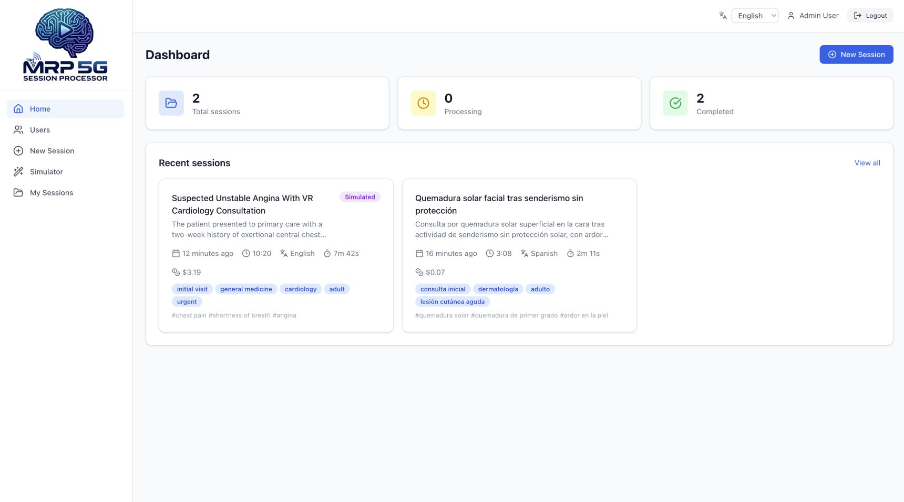 Dashboard|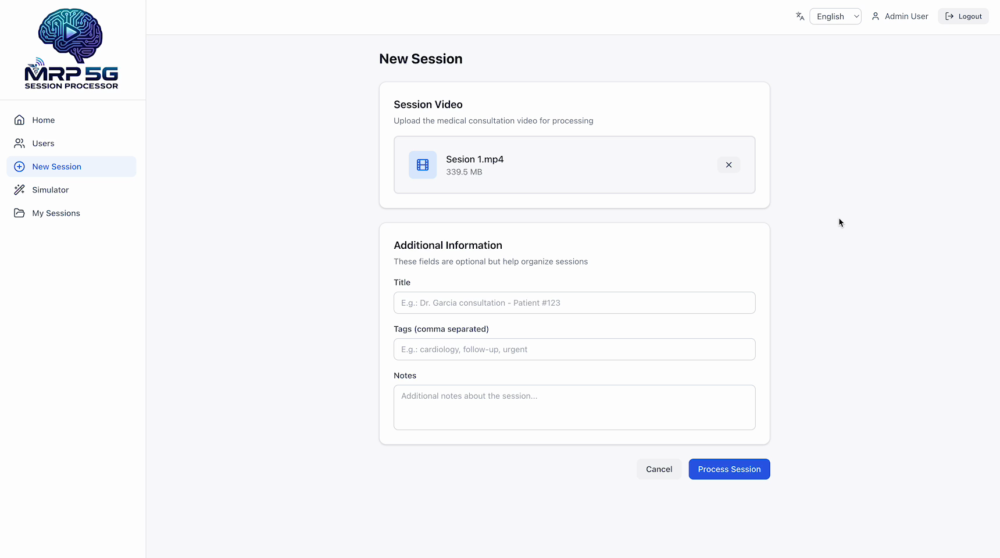 New session|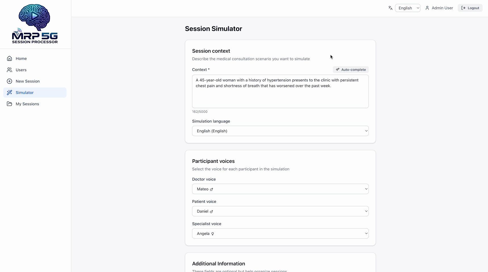 Session simulator|
|:---:|:---:|:---:|
|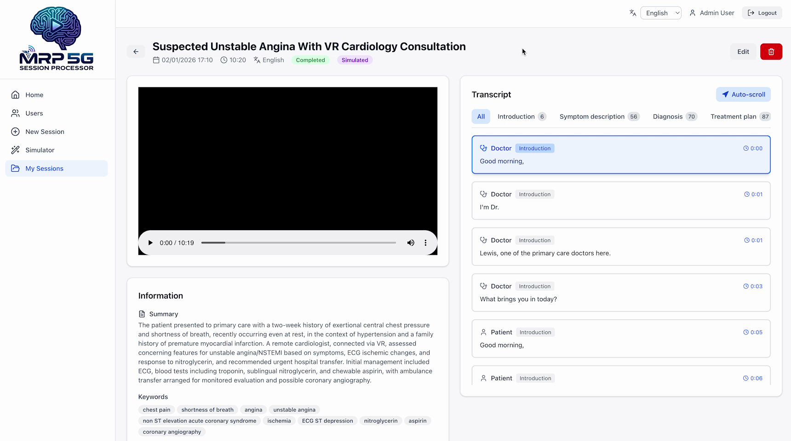 Session: details and overview|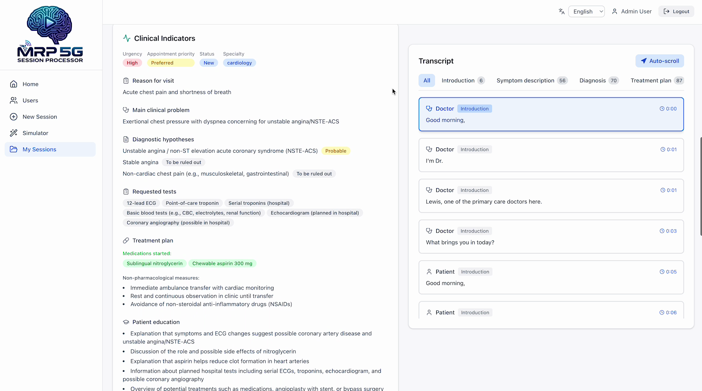 Session: clinical indicators|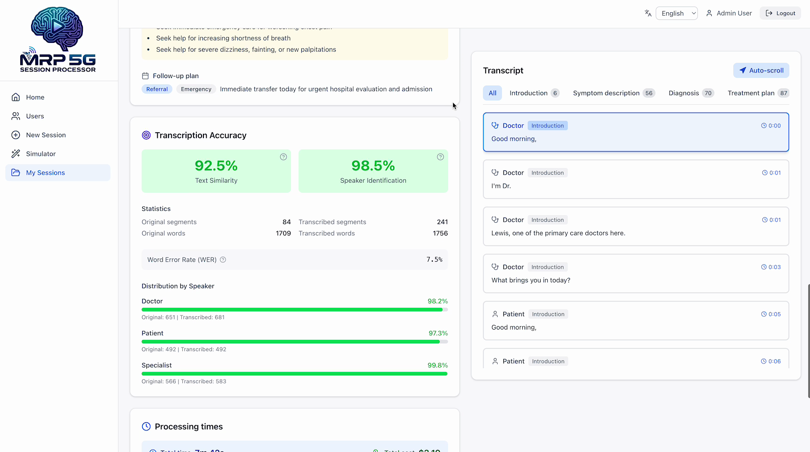 Session: transcription accuracy|
|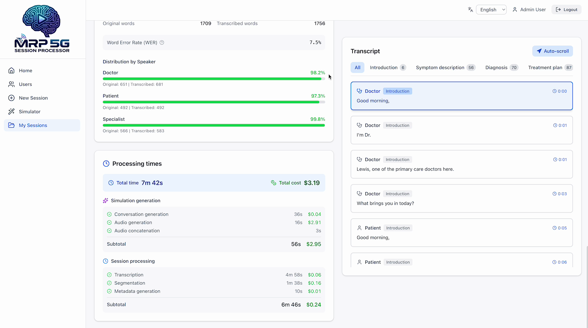 Session: processing times|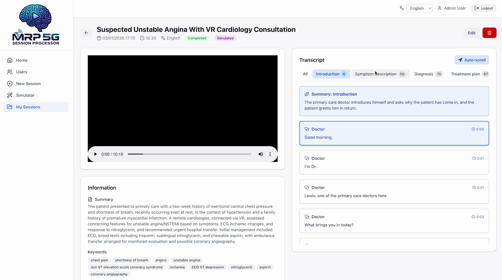 Session: transcription (introduction)| Session: transcription (sympton description)|
|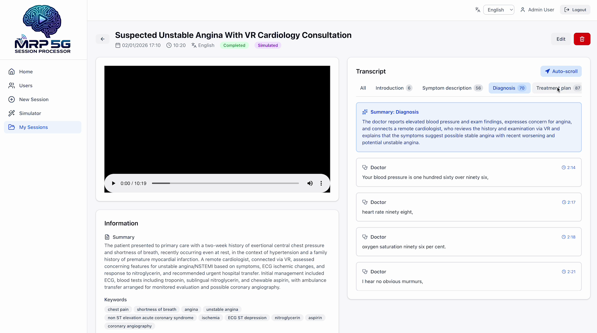 Session: transcription (diagnosis)|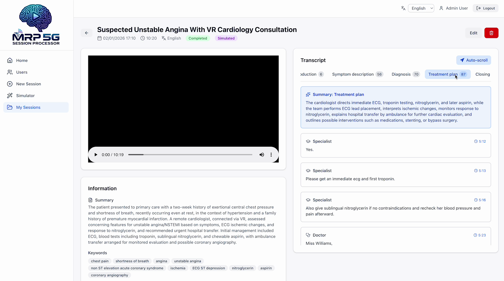 Session: transcription (treatment plan)|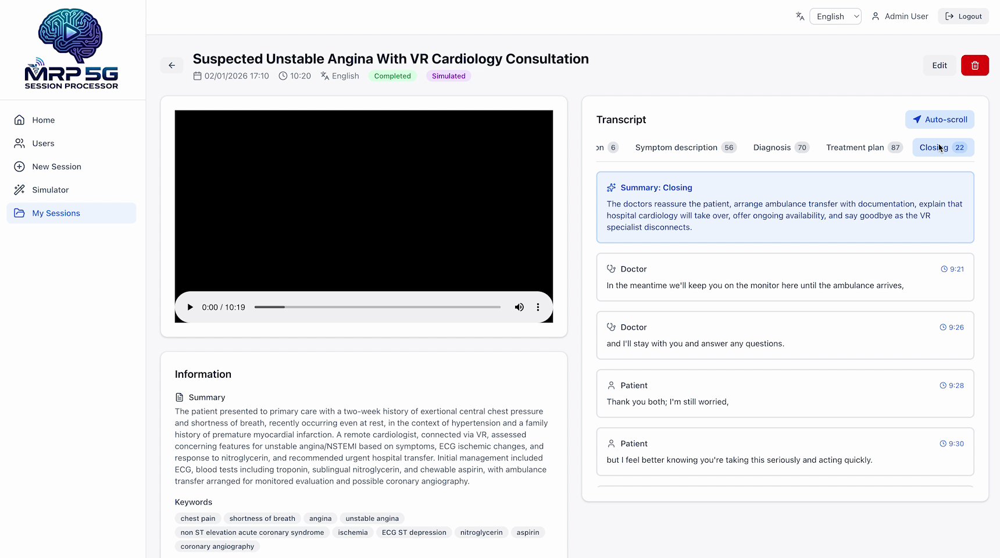 Session: transcription (closing)|

## Features

- **Automatic transcription** with speaker identification using GPT-4o Transcribe Diarize
- **Intelligent segmentation** into medical sections (introduction, symptoms, diagnosis, treatment, closing)
- **Automatic summaries** per section and overall using GPT-5.1
- **Metadata generation**: automatic title, keywords, and tags
- **Full-text search** in transcriptions and metadata
- **Video streaming** with transcription synchronization
- **Asynchronous processing** with job queue
- **Role-based access control (RBAC)**: admin, user, and readonly roles with different permissions
- **Session sharing**: admins can assign sessions to other users with read-only or read-write permissions

## Tech Stack

| Component | Technology |
|-----------|------------|
| Frontend | React 19 + Vite + Tailwind CSS + TypeScript |
| Backend | Express.js + TypeScript |
| Database | SQLite (better-sqlite3) |
| Storage | S3 (Garage for local development) |
| Queue | BullMQ + Redis |
| AI | OpenAI SDK (gpt-4o-transcribe-diarize, gpt-5.1) |

## Development setup

### Prerequisites

- Node.js 20+
- pnpm 9+
- Docker and Docker Compose
- ffmpeg (installed and accessible in PATH)

### Quick start

```bash
# Clone the repository
git clone <repo-url>
cd mrp-5g-session-processor

# Install dependencies
pnpm install

# Start Docker services (Garage S3 + Redis)
pnpm docker:up

# Initialize Garage S3
pnpm docker:init

# Seed users
pnpm db:seed
```

### Configuration

Create a `.env` file in `packages/backend/`, by copying from `.env.example`, and edit the variables as desired. Minimum required:

```env
S3_ACCESS_KEY=your-garage-access-key
S3_SECRET_KEY=your-garage-secret-key

# OpenAI
OPENAI_API_KEY=sk-your-openai-api-key

# ElevenLabs (for session simulator)
ELEVENLABS_API_KEY=your-elevenlabs-api-key

# Simulator Voices (format: ID:Name;ID:Name;...)
# IDs coming from ElevenLabs voices
SIMULATOR_VOICES=voice-id-1:Dr. Rodriguez;voice-id-2:Patient Voice;voice-id-3:Dr. Smith (Specialist)
```

### Usage

```bash
# Development (frontend + backend in parallel)
pnpm dev

# Backend only
pnpm dev:backend

# Frontend only
pnpm dev:frontend

# Production build
pnpm build

# Tests
pnpm test

# Linting
pnpm lint
```

## Project Structure

```
mrp-5g-session-processor/
├── docker/                       # Docker Compose (Garage S3 + Redis)
├── screenshots/                  # README screenshots
├── packages/
│   ├── shared/                   # Shared TypeScript types and constants
│   │   └── src/
│   │       ├── constants/        # Shared constants (languages, etc.)
│   │       └── types/            # Shared TypeScript types
│   ├── backend/                  # Express.js API
│   │   ├── scripts/              # seed-users.ts
│   │   ├── .env                  # Configuration (not to be committed)
│   │   └── src/
│   │       ├── config/           # App configuration
│   │       ├── controllers/      # REST controllers
│   │       ├── db/               # Schema, migrations, repositories
│   │       ├── middleware/       # Auth, upload, errors
│   │       ├── routes/           # Route definitions
│   │       ├── utils/            # Utility functions
│   │       └── services/         # Business logic
│   │           ├── processing/   # Processing workers
│   │           └── simulator/    # Session simulator (TTS)
│   └── frontend/                 # React SPA
│       └── src/
│           ├── api/              # HTTP client
│           ├── components/       # UI components
│           │   ├── auth/         # Authentication components
│           │   ├── layout/       # Layout components
│           │   ├── sessions/     # Session-related components
│           │   ├── simulator/    # Simulator components
│           │   ├── ui/           # Reusable UI components
│           │   ├── users/        # User management components
│           │   └── videos/       # Video player components
│           ├── context/          # React contexts (Auth, etc.)
│           ├── hooks/            # Custom hooks
│           ├── i18n/             # Translations (es-ES, en-GB)
│           ├── pages/            # App pages
│           ├── routes/           # Route definitions
│           ├── styles/           # Global styles
│           └── utils/            # Utility functions
└── pnpm-workspace.yaml
```

## Processing Flow

1. User uploads video → saved to S3
2. Job created in BullMQ queue
3. Worker downloads video and extracts audio with ffmpeg
4. Transcription with speaker identification (gpt-4o-transcribe-diarize)
5. Segmentation into medical sections and speaker re-labeling (gpt-5.1)
6. Summary and metadata generation (gpt-5.1)
7. Status updated to "completed"

## User Roles (RBAC)

| Role | Permissions |
|------|-------------|
| `admin` | Full access: manage users, create/edit/delete sessions, use simulator, assign sessions to other users |
| `user` | Create and manage own sessions, use simulator |
| `readonly` | View only assigned sessions (cannot create, edit, or use simulator) |

Admins can assign any session to other users with either:
- **Read-only**: User can view the session but not modify it
- **Read-write**: User can view and edit session metadata

## Production Deployment

The application is deployed with Docker Compose. Express serves both the API and the static frontend.

### 1. Clone and configure

```bash
git clone <repo-url> mrp-5g-session-processor
cd mrp-5g-session-processor/docker
cp .env.prod.example .env
```

### 2. Edit environment variables

Edit `docker/.env` with actual values:

| Variable | Description |
|----------|-------------|
| `BASE_PATH` | Deployment subpath (e.g., `/mrp-5g-session-processor`) |
| `PORT` | Server port (default: `3001`) |
| `CORS_ORIGIN` | Allowed domain (e.g., `https://app.example.com`) |
| `COOKIE_SECURE` | Cookie secure flag: `auto` (default), `true`, or `false` |
| `SESSION_SECRET` | Secret key of 32+ characters |
| `S3_ENDPOINT` | S3 endpoint (default: `http://garage:3900`) |
| `S3_BUCKET` | S3 bucket name (default: `mrp-videos`) |
| `S3_ACCESS_KEY` | Garage credential (see step 4) |
| `S3_SECRET_KEY` | Garage credential (see step 4) |
| `S3_REGION` | S3 region (default: `garage`) |
| `OPENAI_API_KEY` | OpenAI API key |
| `OPENAI_MODEL_TRANSCRIPTION` | Transcription model (default: `gpt-4o-transcribe-diarize`) |
| `OPENAI_MODEL_SEGMENTATION` | Segmentation model (default: `gpt-5.1`) |
| `OPENAI_MODEL_METADATA` | Metadata model (default: `gpt-5.1`) |
| `ELEVENLABS_API_KEY` | ElevenLabs API key |
| `SIMULATOR_VOICES` | ElevenLabs voice IDs (format: `id1:Name1;id2:Name2`) |
| `SIMULATOR_PAUSE_BETWEEN_SEGMENTS_MS` | Pause between segments in ms (default: `1000`) |
| `SIMULATOR_AUDIO_CONCURRENCY` | Concurrent audio generation jobs (default: `3`) |

### 3. Build the image

```bash
docker compose -f docker/docker-compose.prod.yml build
```

### 4. Initialize Garage S3 (first time)

```bash
# Start only Garage
docker compose -f docker/docker-compose.prod.yml up -d garage

# Wait a few seconds and run the initialization script
bash docker/init-garage.sh
```

The script will display the S3 credentials. Copy them to `docker/.env`:

```
S3_ACCESS_KEY=GK...
S3_SECRET_KEY=...
```

### 5. Create bind mount dirs with correct user permissions

```bash
mkdir -p docker/data/{app,garage,redis}
chown -R 1000:1000 docker/data/app
```

### 6. Start all services

```bash
docker compose -f docker/docker-compose.prod.yml up -d
```

### 7. Create users

```bash
docker exec mrp-app node scripts/seed-users.js
```

### 8. Configure reverse proxy

Example nginx configuration to serve under a subpath:

```nginx
location /mrp-5g-session-processor {
    proxy_pass http://localhost:3001;
    proxy_http_version 1.1;
    proxy_set_header Host $host;
    proxy_set_header X-Real-IP $remote_addr;
    proxy_set_header X-Forwarded-For $proxy_add_x_forwarded_for;
    proxy_set_header X-Forwarded-Proto $scheme;
    client_max_body_size 500M;
}
```

Reload nginx:

```bash
sudo nginx -t && sudo systemctl reload nginx
```

### Management Commands

```bash
# From the project root
docker compose -f docker/docker-compose.prod.yml up -d      # Start
docker compose -f docker/docker-compose.prod.yml down       # Stop
docker compose -f docker/docker-compose.prod.yml logs -f    # View logs
docker compose -f docker/docker-compose.prod.yml build      # Rebuild
```

### Verify Operation

```bash
# Health check
curl http://localhost:3001/mrp-5g-session-processor/health

# Access the application
# https://<domain>/mrp-5g-session-processor/
```

### Data Structure

Data is persisted in local bind mounts:

```
docker/data/
├── app/        # SQLite database
├── redis/      # Redis persistence
└── garage/     # S3 storage
    ├── data/
    └── meta/
```
